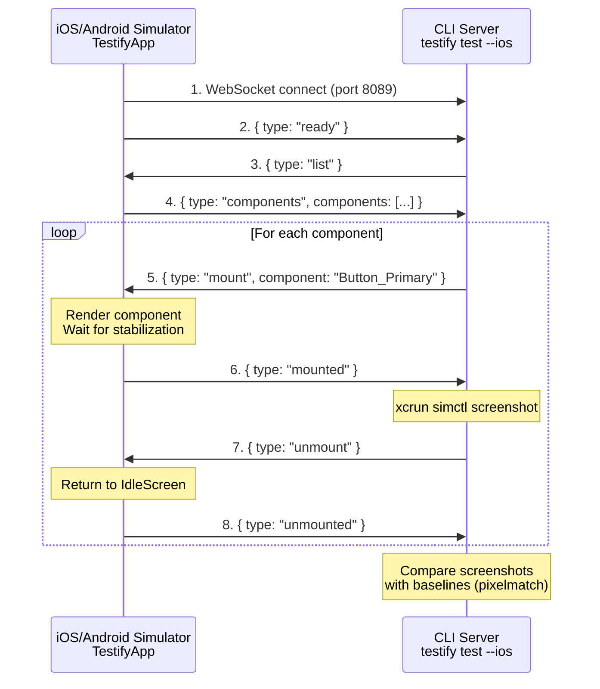

# react-native-testify

Component-level visual regression testing for React Native. Mount components in isolation, capture screenshots, and detect UI changes.

## Features

- **Isolated Component Rendering** - Test components without building the full app
- **Visual Regression Testing** - Compare screenshots against baselines to detect changes
- **Provider Support** - Wrap components with Redux, Theme, or any context providers
- **Async Rendering** - Custom `waitFor` hooks for components with loading states
- **Per-Component Timing** - Configure render stabilization time per component
- **Retry Logic** - Configurable retries for flaky renders
- **CI Ready** - Works with iOS Simulator and Android Emulator in headless mode

## Installation

```bash
npm install react-native-testify
# or
bun add react-native-testify
```

## Quick Start

### 1. Create a component registry

```tsx
// testify/registry.tsx
import { createRegistry } from 'react-native-testify';
import { Button, Card } from '../src/components';
import { ThemeProvider } from '../src/theme';

export default createRegistry({
  'Button_Primary': () => <Button variant="primary" title="Click me" />,
  'Button_Disabled': () => <Button disabled title="Disabled" />,
  'Card_Simple': () => <Card title="Hello World" />,
}, {
  // Wrap all components with providers
  wrapper: (children) => <ThemeProvider>{children}</ThemeProvider>,
  defaultWaitMs: 300,
});
```

### 2. Create the testify entry point

```tsx
// index.testify.js
import { AppRegistry } from 'react-native';
import { TestifyApp } from 'react-native-testify';
import registry from './testify/registry';

const App = () => <TestifyApp registry={registry} />;
AppRegistry.registerComponent('YourApp', () => App);
```

### 3. Create config file

```ts
// testify.config.ts
import { defineConfig } from 'react-native-testify';

export default defineConfig({
  baselines: './testify/baselines',
  threshold: 0.01,
  ios: {
    simulator: 'iPhone 15 Pro',
  },
});
```

### 4. Run tests

```bash
# Record baseline screenshots
npx testify record --ios

# Run visual regression tests
npx testify test --ios

# Update specific baselines
npx testify update Button_Primary --ios
```

## Registry API

### Simple components

```tsx
createRegistry({
  'ComponentName': () => <YourComponent />,
});
```

### With custom wait time

```tsx
createRegistry({
  'SlowComponent': {
    render: () => <SlowComponent />,
    waitMs: 2000,
  },
});
```

### With async waitFor

```tsx
createRegistry({
  'AsyncComponent': {
    render: () => <DataFetcher />,
    waitFor: async () => {
      // Wait for data to load
      await someAsyncCondition();
    },
  },
});
```

### With providers

```tsx
createRegistry({
  'Button': () => <Button />,
}, {
  wrapper: (children) => (
    <ReduxProvider store={store}>
      <ThemeProvider>
        {children}
      </ThemeProvider>
    </ReduxProvider>
  ),
});
```

## Configuration

| Option | Type | Default | Description |
|--------|------|---------|-------------|
| `entry` | string | `./index.testify.js` | Testify entry point |
| `baselines` | string | `./testify/baselines` | Baseline screenshots directory |
| `threshold` | number | `0.01` | Diff threshold (0-1) |
| `defaultWaitMs` | number | `500` | Default render wait time |
| `retryCount` | number | `2` | Retry attempts for flaky tests |
| `retryDelayMs` | number | `1000` | Delay between retries |
| `port` | number | `8089` | WebSocket server port |
| `gitLfs` | boolean | `false` | Enable git-lfs for baselines |
| `baselineStorage` | string | `local` | Storage: `local`, `s3`, `gcs` |

### iOS Config

```ts
ios: {
  simulator: 'iPhone 15 Pro',
  scheme: 'YourApp',
  workspace: 'ios/YourApp.xcworkspace',
  viewport: { width: 393, height: 852 },
}
```

### Android Config

```ts
android: {
  emulator: 'Pixel_7_API_34',
  packageName: 'com.yourapp',
  viewport: { width: 412, height: 915 },
}
```

## How It Works

### Architecture



### Step-by-Step Flow

**1. Start the app with Testify harness:**
```bash
# Metro bundler serves index.js which loads TestifyApp
cd your-app && npx react-native start
```

**2. App shows IdleScreen (Disconnected):**
- WebSocket client tries to connect to `ws://localhost:8089`
- Shows "Attempting to connect on port 8089"

**3. Start CLI server:**
```bash
npx testify record --ios   # Record baselines
# or
npx testify test --ios     # Run tests
```

**4. Connection established:**
- Server logs: `[Server] Client connected`
- App sends: `{ type: "ready" }`
- App shows "Connected" status

**5. Server requests component list:**
- Server sends: `{ type: "list" }`
- App responds: `{ type: "components", components: ["Button_Primary", ...] }`

**6. For each component:**
```
Server sends:  { type: "mount", component: "Button_Primary" }
     ↓
App renders:   <Button_Primary /> (from registry)
     ↓
App waits:     300ms (configurable waitMs)
     ↓
App sends:     { type: "mounted", component: "Button_Primary" }
     ↓
Server runs:   xcrun simctl io booted screenshot /path/to/screenshot.png
     ↓
Server sends:  { type: "unmount" }
     ↓
App returns:   <IdleScreen />
     ↓
App sends:     { type: "unmounted" }
```

**7. After all components:**
- Compare screenshots against baselines using pixelmatch
- Report pass/fail for each component

### Key Files

| File | Role |
|------|------|
| `src/TestifyApp.tsx` | Harness that mounts/unmounts components |
| `src/connection.ts` | WebSocket client (app side) |
| `src/registry.ts` | Component registry with wrappers/waitFor |
| `cli/server.ts` | WebSocket server (CLI side) |
| `cli/device/ios.ts` | `xcrun simctl` commands for screenshots |
| `cli/compare.ts` | pixelmatch image diffing |

## Git LFS for Baselines

Large baseline images can bloat your repo. Enable git-lfs:

```bash
git lfs install
git lfs track "testify/baselines/**/*.png"
```

## License

MIT
