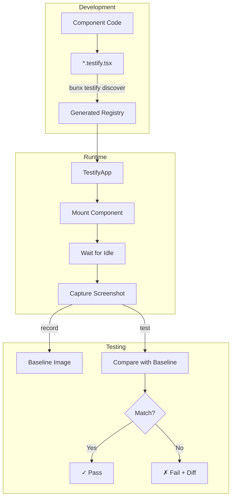

# react-native-testify

Component-level visual regression testing for React Native. Mount components in isolation, capture screenshots, and detect UI changes.

> **Note:** This library requires [Bun](https://bun.sh) runtime for the CLI.

## Features

- **Isolated Component Rendering** - Test components without building the full app
- **Visual Regression Testing** - Compare screenshots against baselines using pixelmatch
- **Provider Support** - Wrap components with Redux, Theme, or any context providers
- **Idle Detection** - Automatically wait for JS thread idle before capturing screenshots
- **Per-Component Config** - Custom wait times, async conditions per component
- **Auto-Discovery** - Discover `*.testify.tsx` files and generate registry automatically
- **Parallel Testing** - Run tests on iOS and Android simultaneously
- **Retry Logic** - Configurable retries for flaky renders

## How It Works



### Workflow Demo

https://github.com/user-attachments/assets/f794629e-62e1-406c-90e4-078fe586842a

## Requirements

- [Bun](https://bun.sh) >= 1.0.0 (for CLI)
- React Native >= 0.65.0
- Xcode (for iOS Simulator)
- Android Studio (for Android Emulator)

## Installation

```bash
bun add @samsara-dev/react-native-testify
```

## Quick Start

### 1. Create component testify files

```tsx
// src/components/Button.testify.tsx
import { Button } from './Button';

export default {
  'Button/Primary': {
    render: () => <Button variant="primary" title="Click me" />,
  },
  'Button/Disabled': {
    render: () => <Button disabled title="Disabled" />,
  },
};
```

### 2. Create config file

```ts
// testify.config.ts
import { defineConfig } from '@samsara-dev/react-native-testify/config';

export default defineConfig({
  baselines: './testify/baselines',
  threshold: 0.01,
  discovery: {
    enabled: true,
    pattern: '**/*.testify.tsx',
    rootDir: './src',
  },
  ios: {
    simulator: 'iPhone 15 Pro',
    bundleId: 'com.yourapp',
  },
});
```

### 3. Generate registry and create entry point

```bash
bunx testify discover
```

```tsx
// index.testify.js
import { AppRegistry } from 'react-native';
import { TestifyApp } from '@samsara-dev/react-native-testify';
import registry from './testify/.generated-registry';
import { ThemeProvider } from './src/theme';

const App = () => (
  <TestifyApp
    registry={registry}
    providers={[{ component: ThemeProvider }]}
  />
);
AppRegistry.registerComponent('YourApp', () => App);
```

### 4. Run tests

```bash
# Record baseline screenshots
bunx testify record --ios

# Run visual regression tests
bunx testify test --ios

# Run tests on Android
bunx testify test --android

# Run parallel tests on iOS + Android simultaneously
bunx testify test --all

# Update specific baselines
bunx testify update Button_Primary --ios
```

## Auto-Discovery Mode

Instead of a central registry, you can create per-component testify files:

### 1. Enable discovery in config

```ts
// testify.config.ts
export default defineConfig({
  discovery: {
    enabled: true,
    pattern: '**/*.testify.tsx',
    rootDir: './src',
    generatedRegistry: './testify/.generated-registry.tsx',
  },
});
```

### 2. Create component testify files

```tsx
// src/components/Button.testify.tsx
import { Button } from './Button';

export default {
  'Button/Primary': {
    render: () => <Button variant="primary" title="Click me" />,
  },
  'Button/Secondary': {
    render: () => <Button variant="secondary" title="Click me" />,
  },
  'Button/Disabled': {
    render: () => <Button disabled title="Disabled" />,
  },
};
```

### 3. Generate registry

```bash
bunx testify discover
```

### 4. Use generated registry with providers

```tsx
// index.testify.js
import { AppRegistry } from 'react-native';
import { TestifyApp } from '@samsara-dev/react-native-testify';
import registry from './testify/.generated-registry';
import { ThemeProvider } from './src/theme';

// Pass providers/wrapper as props to TestifyApp
const App = () => (
  <TestifyApp
    registry={registry}
    providers={[{ component: ThemeProvider, props: {} }]}
    wrapper={(children) => <View style={styles.container}>{children}</View>}
  />
);

AppRegistry.registerComponent('YourApp', () => App);
```

## Idle Detection

By default, screenshots are taken when the JS thread becomes idle (using React Native's `InteractionManager`), rather than waiting a fixed time. This makes tests faster and more reliable.

Configure in your config or per-component:

```ts
// testify.config.ts
export default defineConfig({
  idleDetection: {
    enabled: true,      // default
    timeoutMs: 5000,    // max wait before timeout
    debounceMs: 100,    // stability debounce
  },
});
```

To disable and use fixed wait times:

```ts
idleDetection: {
  enabled: false,
},
defaultWaitMs: 500,
```

## Registry API

### Simple components

```tsx
createRegistry({
  'ComponentName': () => <YourComponent />,
});
```

### With custom wait time

```tsx
createRegistry({
  'SlowComponent': {
    render: () => <SlowComponent />,
    waitMs: 2000,
  },
});
```

### With async waitFor

```tsx
createRegistry({
  'AsyncComponent': {
    render: () => <DataFetcher />,
    waitFor: async () => {
      await someAsyncCondition();
    },
  },
});
```

### With providers

```tsx
createRegistry({
  'Button': () => <Button />,
}, {
  wrapper: (children) => (
    <ReduxProvider store={store}>
      <ThemeProvider>
        {children}
      </ThemeProvider>
    </ReduxProvider>
  ),
});
```

### With store isolation

```tsx
createRegistry({
  'Component': {
    render: () => <Component />,
    freshStore: true,  // Get fresh store for this component
  },
}, {
  storeFactory: () => createStore(),
  storeIsolation: true,  // Enable globally
});
```

## Configuration

| Option | Type | Default | Description |
|--------|------|---------|-------------|
| `entry` | string | `./index.testify.js` | Testify entry point |
| `registry` | string | `./testify/registry.tsx` | Registry file path |
| `baselines` | string | `./testify/baselines` | Baseline screenshots directory |
| `threshold` | number | `0.01` | Diff threshold (0-1) for pass/fail and pixelmatch sensitivity |
| `defaultWaitMs` | number | `500` | Default render wait time (when idle detection disabled) |
| `retryCount` | number | `2` | Retry attempts for flaky tests |
| `retryDelayMs` | number | `1000` | Delay between retries |
| `port` | number | `8089` | WebSocket server port |
| `gitLfs` | boolean | `false` | Enable git-lfs tracking hint |

### iOS Config

```ts
ios: {
  simulator: 'iPhone 15 Pro',
  scheme: 'YourApp',
  workspace: 'ios/YourApp.xcworkspace',
  bundleId: 'com.yourapp',
  viewport: { width: 393, height: 852 },
}
```

### Android Config

```ts
android: {
  emulator: 'Pixel_7_API_34',
  packageName: 'com.yourapp',
  projectDir: 'android',
  gradleTask: 'assembleDebug',
  viewport: { width: 412, height: 915 },
}
```

### Status Bar

Freeze status bar for consistent screenshots:

```ts
statusBar: {
  freeze: true,  // default
}
```

### Discovery Config

```ts
discovery: {
  enabled: false,
  pattern: '**/*.testify.tsx',
  exclude: ['node_modules', 'dist', '.git', 'ios', 'android'],
  generatedRegistry: './testify/.generated-registry.tsx',
}
```

### Idle Detection Config

```ts
idleDetection: {
  enabled: true,
  timeoutMs: 5000,
  debounceMs: 100,
}
```

## CLI Commands

```bash
bunx testify init              # Initialize testify in project
bunx testify build             # Build the app for testing
bunx testify record --ios      # Record baseline screenshots
bunx testify test --ios        # Run visual regression tests
bunx testify test --android    # Test on Android
bunx testify test --all        # Parallel iOS + Android
bunx testify update <name>     # Update specific baseline
bunx testify list              # List registered components
bunx testify discover          # Discover *.testify.tsx files

# Options
--ios                        # Target iOS simulator
--android                    # Target Android emulator
--all                        # Target both iOS and Android (parallel)
--parallel                   # Run tests in parallel on multiple devices
--filter <pattern>            # Filter components (glob pattern)
--watch, -w                   # Watch mode
--config <path>               # Path to config file
--dry-run                     # Preview without writing (discover)
--verbose, -v                 # Show detailed output
```

## Parallel Testing

Run tests on both platforms simultaneously:

```bash
bunx testify test --all
```

Output:
```
┌─ Button_Primary
│  [ios] ✓ Pass
│  [android] ✓ Pass
└─

┌─ Card_Simple
│  [ios] ✓ Pass
│  [android] ✗ 0.42% diff
└─

Results: 3 passed, 1 failed
```

Baselines are stored per-platform:
```
testify/baselines/
├── ios/
│   ├── Button_Primary.png
│   └── Card_Simple.png
└── android/
    ├── Button_Primary.png
    └── Card_Simple.png
```

## How It Works

1. **Start Metro** with testify entry point
2. **CLI launches** simulator/emulator and connects via WebSocket
3. **For each component:**
   - CLI sends mount command
   - App renders component and waits for idle (or fixed time)
   - App signals ready
   - CLI captures screenshot via `xcrun simctl` (iOS) or `adb` (Android)
   - CLI sends unmount command
4. **Compare** screenshots against baselines using pixelmatch
5. **Report** pass/fail with diff images for failures

## Git LFS for Baselines

Large baseline images can bloat your repo:

```bash
git lfs install
git lfs track "testify/baselines/**/*.png"
```

## License

MIT
