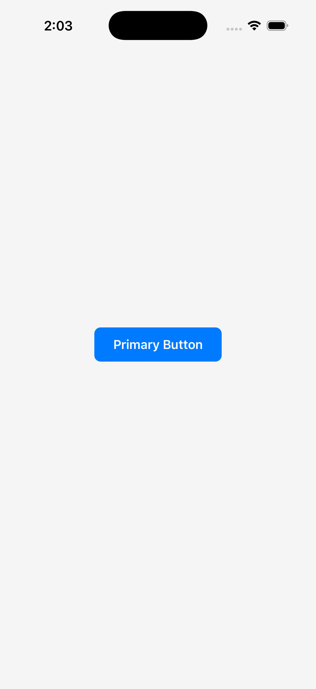
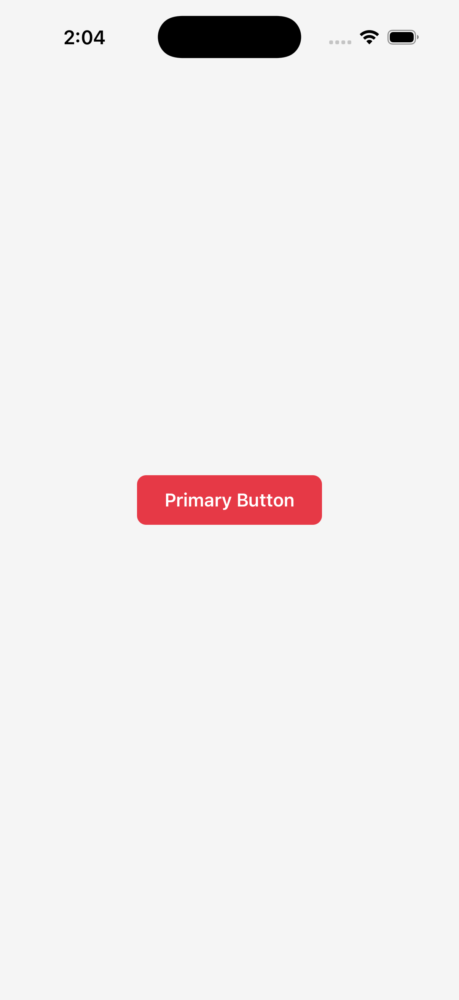

# Visual Regression Testing Demo

This demo shows how react-native-testify catches unintended UI changes using **real iOS Simulator screenshots**.

## The Scenario

A developer accidentally changes the primary button color from `#007AFF` (blue) to `#E63946` (red).

### Before (Baseline)


**Button.tsx (original):**
```tsx
const variantStyles = {
  primary: { backgroundColor: '#007AFF' },  // ✓ Blue button
};
```

### After (Changed)


**Button.tsx (accidentally changed):**
```tsx
const variantStyles = {
  primary: { backgroundColor: '#E63946' },  // ✗ Red button!
};
```

### Visual Diff


The **red highlighted area** shows exactly where pixels changed - in this case, the entire button background.

## Test Output

```
$ npx testify test --ios

Running visual tests for ios...
Testing 15 components

  ✗ Button_Primary - 1.82% diff
  ✓ Button_Secondary
  ✓ Button_Danger
  ...

────────────────────────────────────────
Results: 12 passed, 3 failed

Report: file://testify/baselines/testify-report.html
Diff images saved to: testify/baselines/ios-diff
```

## How It Works

1. **Record baselines** (`npx testify record --ios`)
   - Mounts each component in isolation
   - Takes a screenshot
   - Saves as baseline for future comparison

2. **Run tests** (`npx testify test --ios`)
   - Mounts each component
   - Takes a new screenshot
   - Compares pixel-by-pixel against baseline using [pixelmatch](https://github.com/mapbox/pixelmatch)
   - Generates diff image highlighting changes

3. **Review diffs**
   - If intentional: `npx testify update Button_Primary --ios`
   - If unintentional: Fix the code!

## Threshold Configuration

Adjust sensitivity in `testify.config.ts`:

```ts
export default defineConfig({
  threshold: 0.01,  // 1% tolerance (strict)
  // threshold: 0.1,  // 10% tolerance (lenient)
});
```

## CI Integration

Add to your CI pipeline:

```yaml
# GitHub Actions example
- name: Visual Regression Tests
  run: npx testify test --ios
    
- name: Upload Diffs on Failure
  if: failure()
  uses: actions/upload-artifact@v3
  with:
    name: visual-diffs
    path: testify/baselines/ios-diff/
```

When tests fail, the diff images are uploaded as artifacts for review.
